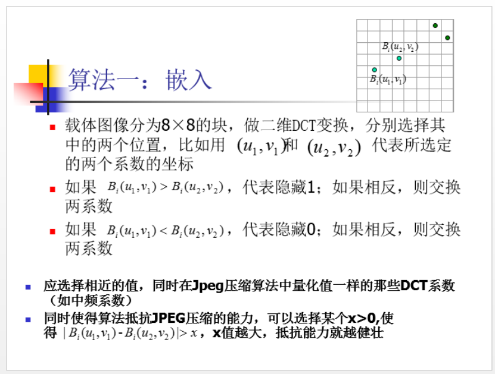

数字水印实验2 图像DCT变换数字水印 
一 实验目的
     （1）了解变换域信息隐藏技术的基本原理
（2）掌握DCT信息隐藏的算法的实现和操作
二  实验材料
256*256的真彩色图片lenna.bmp作为载体, 如图所示

三 实验原理：
   离散余弦变换（DCT）是一种实数域变换，其变换核为实数余弦
函数，图像处理运用的是二维离散余弦变换，对图像进行DCT，可
以使得图像的重要可视信息都集中在DCT的一小部分系数中。
图像DCT变换域的中、低频系数所含有的原始信号成分较多，
由其反变换重构图像能够得到图像的近似部分，而高频系数都非常接近于零，反映的是原始信号的细节部分。
在“参考资料1DCT变换数字水印方法入门.ppt”中介绍了一种采用DCT变换域，将图片DCT变换以后,利用人眼对高频成分的失真不是很敏感的特性,并且DCT变换以后高频成分的系数一般很低,而将水印信息（Hidefile.txt复旦大学数字水印课程 Fudan University Digital Watermarking   2026Spring）嵌入在系数比较低的地方（高频）的算法。
参照上述程序编写的方法，参考课堂讲述以下数字水印嵌入方法，实现在lenna.bmp嵌入“复旦大学”。实现你的嵌入程序和提取程序。

提示：实验实现时，为了降低难度，可以参考实验材料一并给出下列的参考资料：
1.参考资料2随机序列与随机嵌入位的选择
2.参考资料3DCT技术